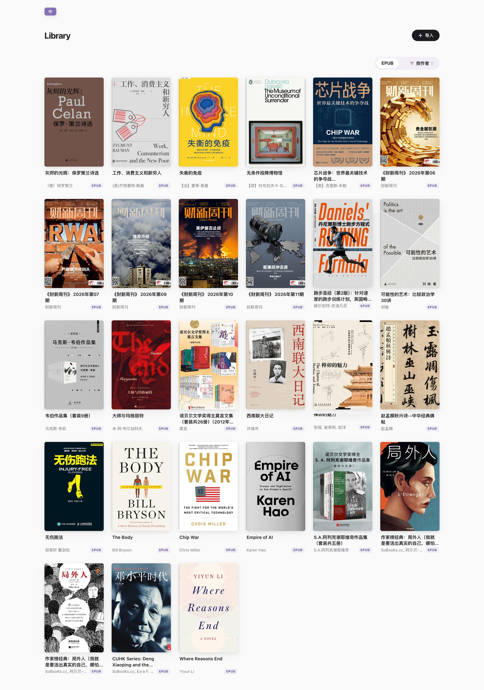
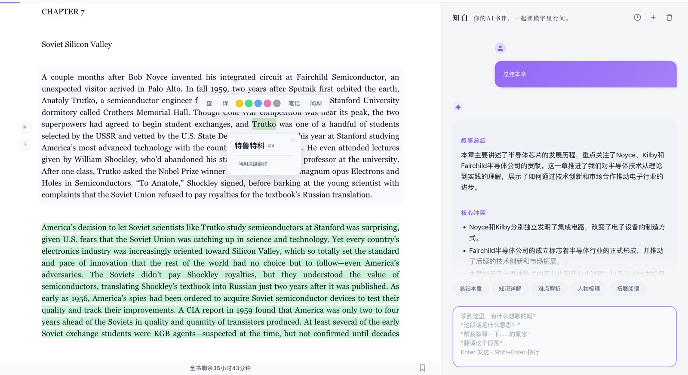
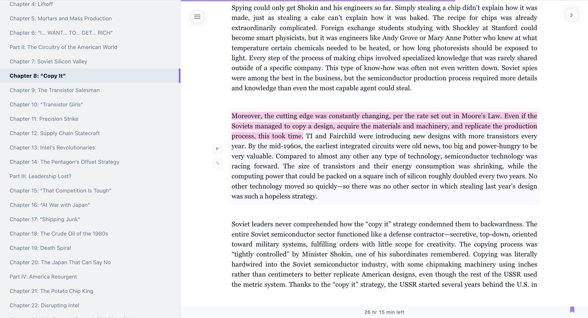
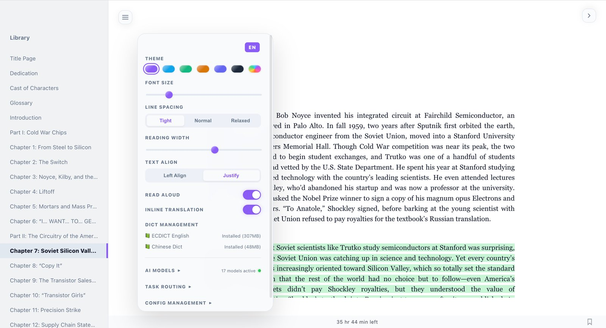

English | [简体中文](README.md) | [繁體中文](README.zh-Hant.md) | [日本語](README.ja.md) | [한국어](README.ko.md) | [Español](README.es.md) | [Français](README.fr.md) | [Italiano](README.it.md)

# 🧊 Smoothie Reader (Reader3)

> "When technology is democratized by AI, aesthetics and human-centric design become the ultimate differentiators."

Inspired by Andrej Karpathy's [minimalist reader prototype](https://x.com/karpathy/status/1990577951671509438), Smoothie Reader is a curated, AI-augmented environment designed for deep reading. As a contemporary art curator based in Shanghai, I've evolved the original "copy-paste to LLM" workflow into a fluid, seamless dialogue between the reader, the text, and the machine.

🏛️ **The Inaugural Exhibit: Meditations**. To honor the spirit of focused contemplation, this repository comes pre-loaded with "Meditations" by Marcus Aurelius (via Project Gutenberg).

<div align="center">
  <br>
  <sub>Your personal library at a glance</sub>
</div>

## ✨ The Curatorial Vision

While most readers only display text, Smoothie Reader treats every page as an exhibit, transforming reading into a holistic intellectual experience:

- 🔍 **Intuitive Discovery**: Highlight any text to reveal the action bar. Built-in support for **ECDICT** (English) and Chinese offline dictionaries.
- 🤖 **The Augmented Dialogue**:
  - **Narrative Translation**: High-quality, contextual translations elegantly embedded within the text.
  - **The Digital Companion**: A sidebar AI assistant supporting streaming dialogue and multi-turn memory for deep intellectual engagement.
  - **Global Connectivity**: Seamlessly integrated with 20+ providers including Gemini, OpenAI, Claude, and DeepSeek.

<div align="center">
  <br>
  <sub>Selection toolbar · Inline translation · AI companion sidebar</sub>
</div>

- 🔊 **Sonic Contemplation (TTS)**: Powered by Edge-TTS, offering 90+ voices to breathe life into the written word.
- ✏️ **The Archive**: 5-color aesthetic highlighting, inline annotations, and persistent bookmarks—all preserved in your **local vault**.

<div align="center">
  <br>
  <sub>Three-column reading: TOC navigation · Immersive text · Multi-color highlights</sub>
</div>

- 🎨 **Minimalist Aesthetics**: 6 curated themes and a flexible 3-column layout, designed for focus and clarity across all devices.

<div align="center">
  <br>
  <sub>Themes, typography, dictionaries, AI models — all in one panel</sub>
</div>

## 🚀 The Installation

This project strictly utilizes [uv](https://docs.astral.sh/uv/) for environment orchestration, ensuring a seamless and isolated performance.

### 1. Preparation
Ensure Python 3.9+ is available. Install the `uv` orchestrator:
```bash
curl -LsSf https://astral.sh/uv/install.sh | sh
```

### 2. Opening the Exhibit
```bash
# Import your first piece (e.g., Dracula)
uv run reader3.py dracula.epub

# Launch the environment
uv run server.py
```
Access the reader at: 👉 **http://localhost:8123**

### 3. Activating the AI
Enter the reading interface, navigate to **Settings**, and configure your **AI Providers**. Connect your essence to the machine (e.g., [get a free Gemini Key](https://aistudio.google.com/apikey)).

> [!TIP]
> **🚀 The Secret Passage**: Anywhere on the page, perform the ritual: **`↑ ↑ ↓ ↓ ← → ← → B A`** (Konami Code) to unveil the **Advanced AI Routing Panel** for multi-model orchestration.

## 🛡️ Sovereignty & Privacy
- **Local Sovereignty**: No data leaves your sanctuary unless you explicitly invoke the AI or TTS.
- **Accountless**: Your archives remain exclusively in your browser's `localStorage`.

## 📚 Further Inquiry
For detailed orchestration instructions, consult the [Curator's Guide](docs/GUIDE.md).

## 📄 Provenance
[MIT License](LICENSE)
